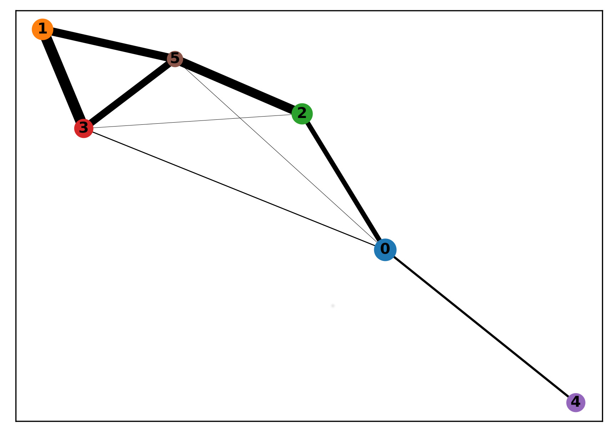
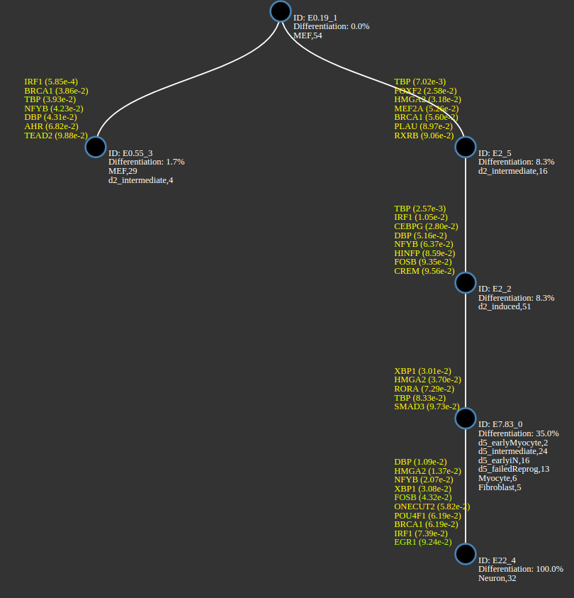

```
    _______.  ______  _______   __   _______  _______ ___   
    /       | /      ||       \ |  | |   ____||   ____|__ \  
   |   (----`|  ,----'|  .--.  ||  | |  |__   |  |__     ) | 
    \   \    |  |     |  |  |  ||  | |   __|  |   __|   / /  
.----)   |   |  `----.|  '--'  ||  | |  |     |  |     / /_  
|_______/     \______||_______/ |__| |__|     |__|    |____| 

```
                                                           
[](https://opensource.org/licenses/MIT)

# INTRODUCTION 
This is the next version of our scdiff software suite (https://github.com/phoenixding/scdiff). 
scdiff was proven very successful in inferring cell differentiation trajectories and the underlying regulatory networks 
(e.g,https://doi.org/10.1016/j.stem.2018.09.009 and https://doi.org/10.1016/j.stem.2019.12.009). 
However, with the rapid development of single-cell technologies, many new computational challenges have been raised 
in understanding various biological processes (e.g., cell differentiation or cancer progression), particularly by deciphering single-cell genomics data. 
Here are a few key challenges that this updated version of scdiff2 strikes to address.

1. New scdiff2 now handle huge single cell data efficiently! 
As the scale of the single-cell RNA-seq datasets is ever-increasing (from hundred cells ->tens of thousand cells and even more. 
The memory and time efficiency for the original scdiff is becoming a bottleneck of its application.  
Here, we have been developing the next version, scdiff2, that uses HDF5, Sparse-matrix, and multi-threading techniques to reduce the resource requirement of the program while improving the efficiency.  Besides, we also incorporated many popular clustering and trajectory methods (mostly implemented by scanpy https://scanpy.readthedocs.io/en/stable)
in a "prerun" program to learn an initial trajectory for future refinement (by HMM-like Probabilistic graphical models).  
scdiff now can finish processing 40k cells (~10k genes/cell) within 4 hours @ a desktop: Ryzen 3500 6 cores, 16G RAM).   

2. New scdiff2 now is fully customizable! (It has many moving pieces and each piece can be customized/modified).  
The selection of the root node (cells) is critical for the tree-structure cell trajectory inference. In scdiff2, we combined the trajectory from PAGA (https://genomebiology.biomedcentral.com/articles/10.1186/s13059-019-1663-x)
and the capture time (the actual time of the cells) to infer a potential root of the tree.  Based on the inferred root, we will build the trajectory based on both gene expression and cell capture time information.
Here, the users are allowed to customize the root of the tree.  The new scdiff2 was composed of 2 passes now. In the first pass, we run the scanpy clustering and PAGA method to infer the initial clusters,
and potential connections between the clusters.  In the second pass, we used an iterative strategy (described in the original scdiff) to get the final trajectory and regulatory networks.  
The preliminary results from the first pass (prerun) can help users choose the root cluster for the second pass (scdiff2 main program). 
Theoretically, any clusters are allowed to be set as the root, the program will automatically learn the best tree structure (and underlying regulatory networks) accordingly. 
Now, the scdiff2 main program accepts an h5ad file (can be produced by a provided pre-run program, or scanpy, or any other methods).  
Please refer to anndata package for details of h5ad file format (https://anndata.readthedocs.io/en/stable/anndata.AnnData.html)
an example h5ad looks like the following:
```
AnnData object with n_obs × n_vars = 152 × 5342
    obs: 'label', 'time', 'n_genes', 'n_genes_by_counts', 'total_counts', 'total_counts_mt', 'pct_counts_mt', 'leiden'
    var: 'n_cells', 'mt', 'n_cells_by_counts', 'mean_counts', 'pct_dropout_by_counts', 'total_counts', 'highly_variable', 'means', 'dispersions', 'dispersions_norm'
    uns: 'diffmap_evals', 'leiden', 'leiden_colors', 'leiden_sizes', 'neighbors', 'paga', 'pca', 'rank_genes_groups', 'umap'
    obsm: 'X_diffmap', 'X_pca', 'X_umap'
    varm: 'PCs'
    obsp: 'connectivities', 'distances'
```
The scdiff2 main programs used the following attributes, make sure to include them if you want to supply scdiff2 with your customized h5ad result. 
```
 AnnData object with n_obs × n_vars = 152 × 5342
    obs: 'time', 'leiden'
    var: 
    uns:  'paga'
    obsm: 'X_diffmap', 'X_pca', 'X_umap'
``` 

The --input for the scdiff2 must be in anndata format(https://anndata.readthedocs.io/en/stable/anndata.AnnData.html). 
You can use the provided 'prerun' program or 'scanpy' for the prerun analysis.


# PREREQUISITES
* python3.6+
It was installed by default for most Linux distribution and MAC.  
If not, please check [https://www.python.org/downloads/](https://www.python.org/downloads/) for installation 
instructions. 
*PLEASE NOT*: python 2.7 is no longer supported by the scdiff software suite. Please consider upgrading to Python3.6+/  

* Python packages dependencies:    
	-- scipy>0.13.3    
	-- numpy>1.8.2   
	-- scikit-learn>=0.20,<=0.22  
	-- matplotlib>=3.1.2  
	-- imbalanced_learn<0.5.0  
	-- anndata>=0.7  
	-- scanpy>=1.5  
	-- pandas>=0.23  
	-- h5py>=2.10  
The python setup.py script (or pip) will try to install these packages automatically.
However, please install them manually if, by any reason, the automatic 
installation fails. 

# INSTALLATION
 There are 2 options to install scdiff.  
* __Option 1: Install from download directory__   
	cd to the downloaded scdiff package root directory

	```shell
	$ cd scdiff
	```
	run python setup to install   

	```shell
	$ python3 setup.py install
	```
	
* __Option 2: Install from Github__ (recommended):    

	python 3: 
	```shell
	$ sudo pip3 install --upgrade https://github.com/phoenixding/scdiff2/zipball/master
	```
		
# USAGE
(1) 1st pass: prerun  
```shell
usage: prerun [-h] -i INPUT -o OUTPUT -f FORMAT

scdiff2 pre-run

optional arguments:
  -h, --help            show this help message and exit
  -i INPUT, --input INPUT
                        input single cell RNA-seq expression data
  -o OUTPUT, --output OUTPUT
                        output directory
  -f FORMAT, --format FORMAT
                        the format of input expression, either raw/norm (raw:
                        raw read counts, norm: normalized expression
                        
```
For the prerun, it has 3 parameters as the following:     
	 -- -i expression_matrix  
		expression_matrix is the same as the orignal scdiff (https://github.com/phoenixding/scdiff#inputs-and-pre-processing).  
		1st column: cell id  
		2nd column: capture time (must real value)    
		3nd column: label (label for each cell in visualization, not used in the inference, can be set as 'NA' if unknown)    
		4th- columns: expression for all genes  
	-- -o outputdir   
	outputdir specifies the output directory.  
	-- -f format  
	It can be set as 'raw' (represent raw reads expression) or 'norm' (represents log normalized expression)
	'raw' format should be good for all inputs (best for the raw reads expression matrix, but should be also fine for normalized expression).  
	If setting the 'norm', no more processing (e.g, filtering cells, genes and normalization, batch effect remover) will be performed.   
	The program will directly use the supplied expression matrix as it is, which is not good in many cases, especially when you haven't normalized the data properly. 
	

(2) 2nd pass: scdiff2
```
usage: scdiff2.py [-h] -i INPUT -o OUTPUT -t TFDNA [--etfListFile ETFLISTFILE]
                  [--log2fc LOG2FC] [--ncores NCORES] [--root ROOT]
                  [--llhCut LLHCUT] [--maxloop MAXLOOP]

scdiff2 main

optional arguments:
  -h, --help            show this help message and exit
  -i INPUT, --input INPUT
                        h5ad result from pre-run
  -o OUTPUT, --output OUTPUT
                        output directory
  -t TFDNA, --tfdna TFDNA
                        TF-DNA interaction data
  --etfListFile ETFLISTFILE
                        By default, this program recognizes 1.6k TFs
                        (collected in human and mouse). Users are able to
                        provide a customized list of TFs　using this option
                        (e.g, for another species).
  --log2fc LOG2FC       By default, scdiff uses log2 Fold change
                        0.6(=>2^0.6~=1.5) as the cutoff for differential genes
                        (together with student t-test p-value cutoff 0.05).
                        Users can customize this log fold change cutoff.
  --ncores NCORES       # of allocated cpu cores for multi-threading the job
                        (4 by default)
  --root ROOT           Set the root (of the tree) as an input cluster ID
                        (e.g., 0 from the prerun result)
  --llhCut LLHCUT       The convergence likelihood cutoff, the program stops
                        if the cell assignment likelihood improvement is
                        smaller than this cutoff (e.g. 0.05: 5 percent)
  --maxloop MAXLOOP     The max # of loops allowed for the PGM based iterative
                        refinment. Set it to 0 to directly use the clustering
                        and trajectory results from the prerun program (scanpy
                        based). Only the regulatory networks (TFs) and the
                        interactive visulzation page will be learned and
                        generated

```
For the scdiff2 main program, it has 3 *REQUIRED* parameters:   
	-- -i h5ad result  
		the results from the first run  
	-- -o outputdir
		outputdir specifies the output directory.  
	-- -t tf_dna
		tf_dna specifies the tf-dna interaction file, it's the same format as the original scdiff.   
	all other parameters are optional.   
# EXAMPLE
## (1) Example input files   
We have provided an example (ipython notebook) in the example directory [example/](example)  

a) example expression file for pre-run : [example/example.E](example/example.E)  
b) example　tf_dna file: [example/Human_TF_targets.txt](example/Human_TF_targets.txt)  

After installing scdiff2 successfully, cd to the example folder and run the following commands to analyze the example single-cell genomics data. 
```shell
$ prerun -i example.E -o example_out -f raw
$ scdiff2 -i example_out/example.E.h5ad -o example_out -t example_tfdna.txt --ncores 10
```
## (2) Example output files    
You can check all the output results under the output directory:       
i) Result with the PGM refinement (--llhCut -0.05 --maxloop 5) : [example/example_out](example/example_out)  
ii Result *without* the PGM refinment (--maxloop 0) : [example/example_out_no_PGM_refinement](example/example_out_no_PGM_refinement)   

a) A PGM refined tree-structure cell differentiation (MEF-> Neuron) trajectory for the example data (from Treutlein et al. 2016 Nature Paper on Neuron reprogramming).    
PGM refined clustering (colored by scdiff2 clusters and colors)   
  
b) A PGM refined PAGA connectivity tree  
  
c) A PGM refined scdiff tree model with the regulatory information (TFs) (interactive visualized).   

 

PGM VS. no refinement performance comparison (for this example data): 

Likelihood :  With PGM refinement (-1196.0434282645167)> Without PGM refinement (-1334.8432584323705) => Total improvement 10.34%  
Running time:   With PGM refinement (~9mins) > without PGM refinement (~1min) => ~9 times slower 

For best experience, please use >16G RAM and try to use any many threads (--ncores) as possible.  


# CREDITS
 
This software was developed by ZIV-system biology group @ Carnegie Mellon University.  
Implemented by Jun Ding.

Please cite our paper [Reconstructing differentiation networks and their regulation from time series single cell expression data](https://genome.cshlp.org/content/early/2018/01/09/gr.225979.117).
scdiff2 uses many functions from scanpy (https://scanpy.readthedocs.io/en/stable/api/index.html) for the initialization.  Many thanks for the great tool. 
A PGM refined clustering results (colored by scdiff2 clusters, and capture time of the cells).    

# LICENSE 
 
This software is under MIT license.  
see the LICENSE.txt file for details. 


# CONTACT 
jund  at cs.cmu.edu


                                 
                                 
                                 
                                 
                                 

                                                     
